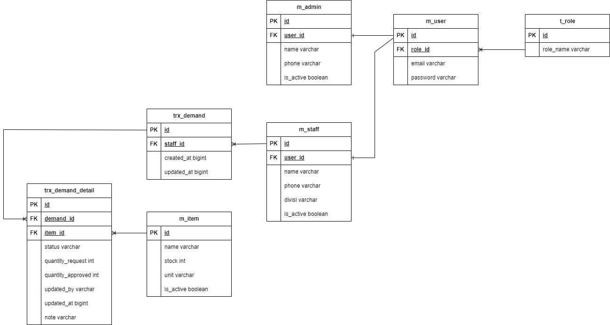

# Inventory Management System

Project, an online items request application. This application aims to make it easier for staff and administration to manage requests for items in the office. The staff will request several items from the admin (administration) according to the number of stock items available and the admin can process the request (approve or reject). Admin can manage the quantity received regarding item requests and provide a note.

### ERD(Entity Relational Diagram)


### Build With
- [Springboot v3.2.4](https://spring.io/)
- [Java 17](hhttps://www.oracle.com/java/technologies/javase/jdk17-archive-downloads.html)
- [PostgreSQL](https://www.postgresql.org/docs/)
- [Swagger](https://realrashid.github.io/sweet-alert/)
- [Maven](https://maven.apache.org/)

### Prerequisites

This is an example of how to list things you need to use the software and how to install them.

- Java IDEA
- PgAdmin or other PostgreSQL DBMS
- Postman or other API Testing Apps like Swagger.ui

### Installation

1. Clone the repo
   sh
   https://github.com/juanliestanto/api-inventory.git

2. Edit application.properties Config
```properties
   spring.datasource.username=YOUR_DATABASE_USERNAME
   spring.datasource.password=YOUR_DATABASE_PASSWORD
   spring.datasource.url=jdbc:postgresql://localhost:5432/YOUR_DATABASE_NAME
   spring.datasource.driver-class-name=org.postgresql.Driver
   spring.jpa.properties.hibernate.dialect=org.hibernate.dialect.PostgreSQLDialect
   spring.jpa.hibernate.ddl-auto=update
   spring.jpa.show-sql=true
   app.shopee.jwt.jwt-secret = secretajalah
   app.shopee.jwt.jwt-name = Inventory Apps
   app.shopee.jwt.jwt-expired = 3600
   ```


3. Install all dependencies and run Maven reload

4. Then run the project

### API Documentation
Postman : https://documenter.getpostman.com/view/32334945/2sA35G31o8

# Features
### Auth
- APP User :
```
class AppUser{
    String id;
    String email;
    String password;
    Role role;
}
```
- Role:
```
class Role{
    String id;
    String role; //enum
}
enum ERole{
    ROLE_STAFF,
    ROLE_ADMIN
}
```

### DEMAND
- Staff:
```
class Staff{
    String id;
    User user;
    String name;
    String phone;
    EDivisi divisi; 
    Boolean isActive;
    List<Demand> demandList;
}
Enum EDivisi{
    HR,
    FINANCE,
    IT,
}
```
- Admin
```
class Admin{
    String id;
    User user;
    String name;
    String phone;
    Boolean isActive;
}
```
- Item
```
class Item{
    String id;
    String name;
    Int stock;
    String unit;
    Boolean isActive;
    List<DemandDetail> demandDetailList;
}
```
- Demand
```
class Demand{
    String id;
    Long createdAt;
    Long updateAt;
    Staff staff;
    List<DemanDetail>demanDetail;
}
```
- Demand Detail
```
class DemandDetail{
    String id;
    Demand demand;
    String updateBy;
    Long updateAt;
    Item item;
    Integer quantityRequest;
    Integer quantityApproved;
    EStatus status;
    String note;
}
Enum EStatus{
    APPROVED,
    REJECTED,
    PENDING
}
```